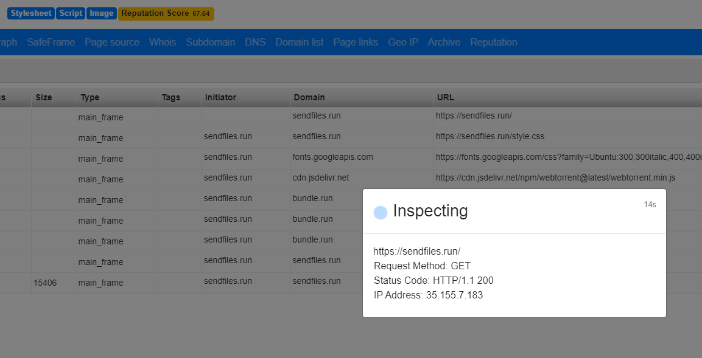

# DeepPhish (browser extension)

A light inspection and detection plugin that uses machine learning and a set of recon tools to scrutinize any website for unsafe content. It is built with privacy in mind. Classification is done on the client side. No user data is collected.


## Features

### Detection

- Real-time detection as you browse (using ML)
- Real-time website analysis and scoring (0 to 100)
- Historical score tracking and notification for decreased/increased security (in case of defacing, hacking etc.)
- Do Not Disturb mode
- Mute notification for certain websites only

### Inspection

- Requests, network graph
- DNS, domain, subdomains, whois information
- GeoIP, ads, crawlers, page links
- Page source, cookies, reputation . . .

## Installation

- Download or clone this repo
- Open Chrome Extension Menu and enable Developer mode at
  ```chrome://extensions/```
- Click "Load unpacked" and select 'DeepPhish-chrome-unpacked' folder

## Usage

- Use context menu on a page (right-click "Inspect page with DeepPhish")
- Use context menu on a link (right-click "Inspect link with DeepPhish")

## API keys 

Open a new, empty tab and click on DeepPhish icon at top right to show API page.
Enter your own keys (free tier will do):


## To do

- Port to Firefox
- Migrate to Manifest V3 for Chrome?
- Switch to use IndexedDB 

## Screenshots

### Notification


### Context menu options


### Popup page


### Score and Index


### Options page


### About page


### Inspection



### Results


## References

- [Intelligent phishing website detection using random forest classifier](https://ieeexplore.ieee.org/abstract/document/8252051/)
- [Phishing website features](PhishingWebsitesFeatures.docx)
- [Dataset](https://archive.ics.uci.edu/ml/datasets/phishing+websites)


## License

[GPL-3.0](LICENSE)
